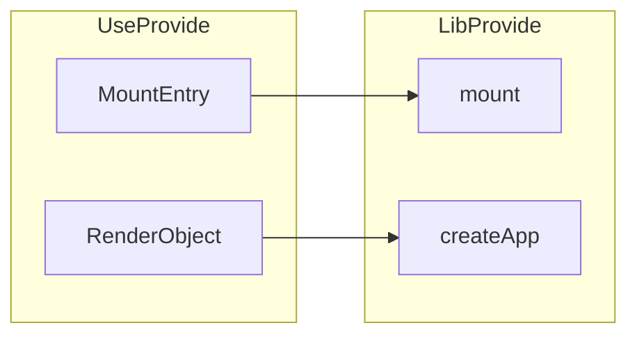

# 开始

### 渲染 -> 挂载

创建基本的复用结构

### 分离挂载和渲染

把 渲染(renderer) 和 挂载(createApp) 分离

使用端 提供渲染(渲染函数) 运行挂载
库模块 执行渲染, 提供挂载逻辑



```js
// 库模块
export const createApp = (options): App => {
  return {
    mount: selector => {
      const root = document.querySelector(selector)
      if (root) {
        root.innerHTML = options.render()
      }
    },
  }
}
```

---

```js
// 浏览器脚本
import { createApp } from "chibivue";
const app = createApp({
  render() {
    return "Hello world.";
  },
});
app.mount("#app");
```
