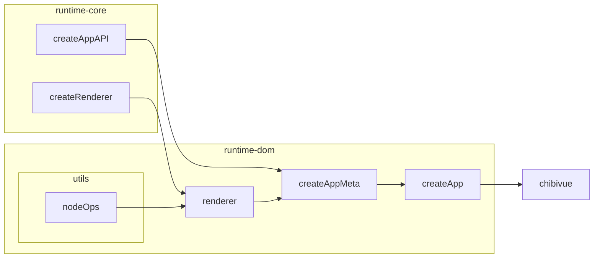

## day 1 重构API

依赖反转

使用 `createAppAPI` 隔离 `createApp`
使用 `createRenderer` 隔离 `renderer`

```mermaid
  flowchart LR
    vue["chibivue"]
    createAppFactory["createAppAPI"]
    rendererFactory["createRenderer"]
    nodeOperations["nodeOps"]

    subgraph runtime-core
      createAppFactory
      rendererFactory
    end

    subgraph runtime-dom
      subgraph utils
        nodeOperations
      end
      nodeOperations --> renderer
      createAppFactory --> createAppMeta
      rendererFactory --> renderer
      renderer --> createAppMeta
      createAppMeta --> createApp
    end

    createApp --> vue

```
