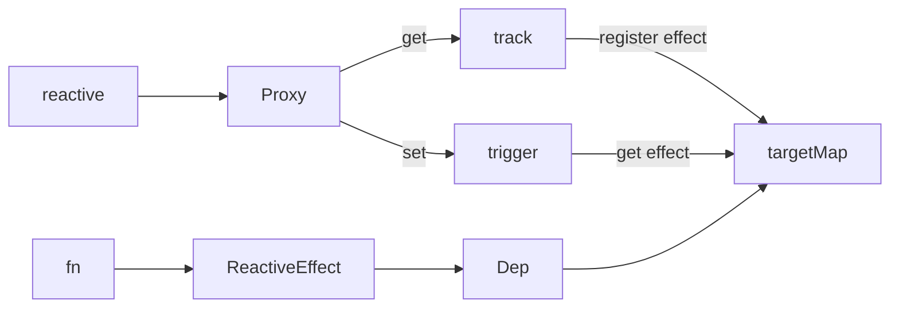

# Minimal Reactivity System

```mermaid
  flowchart LR
    reactiveProxy["Proxy"]
    reactive --> reactiveProxy
    reactiveProxy --get--> track
    reactiveProxy --set--> trigger
    track --register effect--> targetMap
    trigger --get effect--> targetMap

    Dep --> targetMap
    ReactiveEffect --> Dep
    fn --> ReactiveEffect
```
