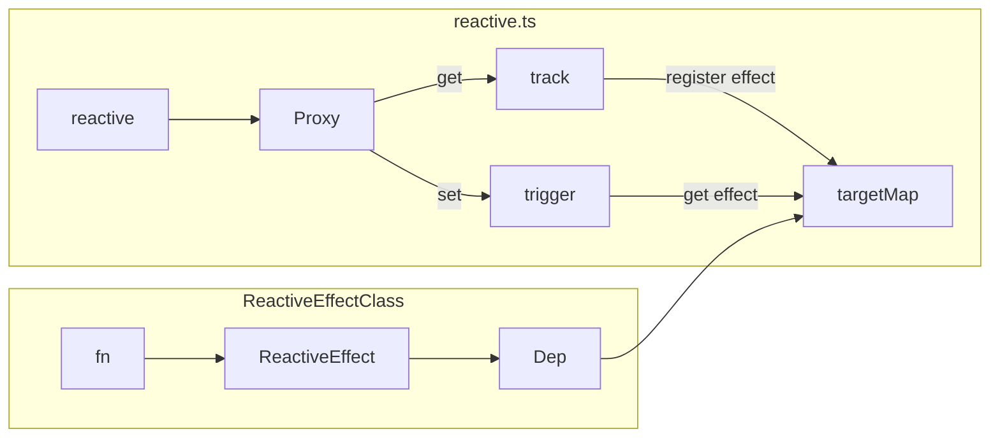

# Minimal Reactivity System

```mermaid
  flowchart LR
    reactiveProxy["Proxy"]
    targetWeakMap["targetMap"]

    subgraph reactive.ts
      reactive --> reactiveProxy
      reactiveProxy --get--> track
      reactiveProxy --set--> trigger
      track --"register effect"--> targetWeakMap
      trigger --"get effect"--> targetWeakMap
    end

    subgraph ReactiveEffectClass
      Dep --> targetWeakMap
      ReactiveEffect --> Dep
      fn --> ReactiveEffect
    end
```
