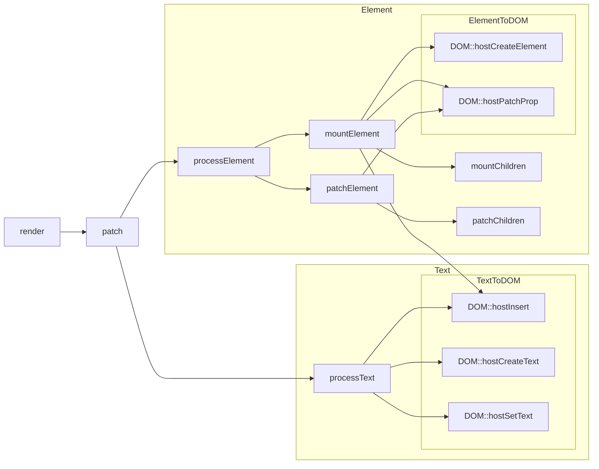

```mermaid
  flowchart LR
    render --> patch
    patch --> processText
    patch --> processElement
    subgraph processTextBlock["Text"]
      processText --> DOM::hostInsert
      processText --> DOM::hostCreateText
      processText --> DOM::hostSetText

      subgraph processTextDom["TextToDOM"]
        DOM::hostInsert
        DOM::hostCreateText
        DOM::hostSetText
      end
    end
    subgraph processElementBlock["Element"]
      processElement  --> mountElement
      processElement  --> patchElement

      mountElement --> DOM::hostCreateElement
      mountElement --> mountChildren
      mountElement --> DOM::hostPatchProp
      mountElement --> DOM::hostInsert
      subgraph mountElementDom["ElementToDOM"]
        DOM::hostCreateElement
        DOM::hostPatchProp
        DOM::hostInsert
      end
      patchElement --> patchChildren
      patchElement --> DOM::hostPatchProp
    end
```
